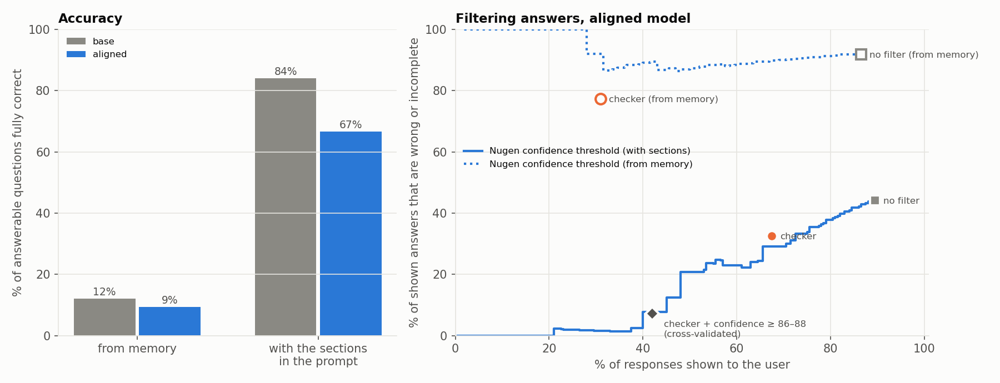

# Does Nugen's confidence score mean anything?

Nugen's inference API puts a `confidence_score` (0–100) on every answer from a domain-aligned model. If that number predicts whether the answer is right, you can build on it: answer when it's high, say "I don't know" when it's low. That's the whole pitch for legal/finance work. So instead of an aligned model plus a chatbot, this repo aligns a model on Indian real-estate law, measures whether the score earns that trust, and builds the assistant around what the measurements say.

Corpus: the Real Estate (Regulation and Development) Act, 2016 and the Telangana RERA Rules, 2017. Both are official PDFs converted to text with section numbers kept (`data/SOURCES.md`). The base model is `llama-v3p2-3b-reasoning`.

## Results

It depends on whether the model has the text in front of it. Answering from memory, the aligned model gets 9% of questions right and its confidence is noise (AUROC 0.54): it says you have 30 days to appeal to the Appellate Tribunal at confidence 85, where section 44(2) says sixty. Give it the relevant sections and it gets 67% right, and the same score becomes a good ranking signal (AUROC 0.93). Put a threshold on it plus a deterministic check of every figure in the answer against the text, and, validated leave-one-question-out, the assistant answers 42% of questions, 7% of those answers are wrong or incomplete, and it declines all ten questions the documents can't answer.

The finding I'd most want Nugen to look at: the base model beats the aligned one in both conditions.



| | aligned, from memory | base, from memory | aligned, with sections | base, with sections |
|---|---|---|---|---|
| fully correct (answerable, 95% CI) | 9% [0, 20] | 12% [3, 23] | 67% [50, 82] | 84% [71, 97] |
| correct / partial / wrong / declined (150) | 14 / 37 / 86 / 13 | 18 / 41 / 87 / 4 | 100 / 39 / 11 / 0 | 126 / 15 / 5 / 4 |
| declines the 10 unanswerable questions | 28% | 26% | 42% | 36% |
| same label on all 5 repeats | 72.5% | 75.0% | 82.5% | 87.5% |
| AUROC, mean confidence → correct | 0.54 [0.34, 0.73] | no score | **0.93** [0.85, 0.99] | no score |
| AUROC, lowest confidence → correct | 0.78 [0.47, 0.98] | no score | 0.76 [0.60, 0.90] | no score |
| ECE (mean confidence) | 0.66 | – | 0.25 | – |
| latency p50 / p95 | 1.5 / 3.5 s | 2.8 / 7.1 s | 2.0 / 4.9 s | 3.2 / 6.2 s |
| served OK first try | 200 / 200 | 200 / 200 | 200 / 200 | 200 / 200 |

"With sections" means the top four sections or rules from a plain BM25 search over the corpus go into the prompt, and the model is told to answer only from them. The right section is in those four for 29 of the 30 answerable questions.

Some things behind those numbers:

- From memory, the aligned model's 14 correct answers all come from three questions. The 0.78 on the lowest reading is mostly those three questions having high confidence, which is why its interval runs from 0.47 to 0.98.
- With the sections, correct answers sit at a median confidence of 90, wrong or incomplete ones at 81, and answers to unanswerable questions at 77. Above about 88 almost everything is right. It ranks well, but it isn't a probability: the ECE of 0.25 means a score of 80 doesn't mean an 80% chance of being right. Something like "the answer is supported by the context" seems to be what it tracks, not whether the answer is true, which would explain why it says nothing useful when there is no context. (`results/rag/headline.png` has the reliability diagram.)
- Which reading of the stream to use flips between conditions. From memory the lowest reading is the least bad; with the sections the mean is clearly best. Anyone building on this score should check which one they're thresholding.
- The aligned model's answers are much shorter (median 123 characters from memory against 299 for base). With the sections that costs it: 39 of its 150 answers are partial, usually the first half of a two-part answer ("ten per cent" without the three years' imprisonment for continuing).
- Nugen's own auto-generated benchmark, the 30 Q&A pairs the alignment was built around (`results/nugen_benchmark.json`), overlaps with nine of my questions (the 500 m² threshold, the one-year extension cap, the ₹5,000 appeal fee, 70% into the separate account...). From memory the aligned model got those fully right 4 times out of 45, the base model 11. It said the 500 m² threshold and the appeal fee were "not specified" on every repeat. Whatever the alignment did, it didn't put its own benchmark into the model.
- The sections don't fix unanswerable questions by themselves. Asked for the Karnataka registration fee, both models read the Telangana fee out of the retrieved rule and gave it, the aligned one at confidence 93. That's what the scope check in the checker is for.
- Consistency is high everywhere, and from memory that's not good news: most questions got the same wrong answer five times. At temperature 0.1 it's a vending machine, it just dispenses the wrong thing reliably. With the sections it's the same machine dispensing mostly the right thing.

Nugen's own evaluation didn't run while I was testing, so there's nothing to set beside this one from their side. The job (`evaluation_01m3ptzh4gn430gz`) sat at `CREATED` with zero samples, its `/status` route returned HTTP 500 on every poll, and `/results` said "not completed yet" (`results/nugen_eval.json`). It's possible I missed a step that starts it, although I retried it 3 hrs later. The model page shows accuracy 0.0 and response time 0.0, which look like placeholders.

## The checker

`nugen/verify.py` is about a hundred lines and uses no model. For each answer it does two things:

1. Scope. If the question names something that appears nowhere in the Act or the Rules ("Karnataka", "MahaRERA", "GST", "2BHK", "Newtech", "Andhra Pradesh"), no answer can come from them. This catches 6 of the 10 unanswerable questions before the model is called, and none of the 30 answerable ones. The other four (stamp duty rate, first TG-RERA chairperson, late fee, empanelled banks) use words the documents do contain, so the model has to decline those itself.
2. Figures. Every number in the answer (days, months, per cent, rupees, section and rule numbers) has to appear in the provisions the model was given. "30 days" against a section that says "sixty days" fails. Word numbers and digits are normalised, so "sixty" matches 60 and "five lakh" matches 500000.

`scripts/checker_eval.py` compares it with Nugen's score on the same footing: of the responses a filter lets through, what share are wrong or incomplete?

| | shown | wrong or incomplete | correct answers kept | unanswerable answers shown |
|---|---|---|---|---|
| aligned, from memory, no filter | 173 / 200 | 92% | 14 / 14 | |
| aligned, from memory, checker | 62 / 200 | 77% | 14 / 14 | 2 / 50 |
| aligned, from memory, confidence at the same coverage | | 92% | | |
| aligned, with sections, no filter | 179 / 200 | 44% | 100 / 100 | |
| aligned, with sections, checker | 135 / 200 | 33% | 91 / 100 | 4 / 50 |
| aligned, with sections, confidence at the same coverage | | 29% | | |
| **aligned, with sections, confidence ≥ 87–88 alone (cross-validated)** | 85 / 200 | 8% | 78 / 100 | 5 / 50 |
| **aligned, with sections, confidence ≥ 87 and checker (cross-validated)** | 84 / 200 | 7% | 78 / 100 | 0 / 50 |
| base, with sections, checker (no confidence score) | 139 / 200 | 10% | 125 / 126 | 0 / 50 |

So from memory nothing works, though the checker is less bad than the score. With the sections the score is the better filter for wrong answers, because most of the remaining errors are incomplete answers and a figure check can't see a missing fact. What the checker adds is the unanswerable questions: with it, none got through. The last row is the uncomfortable one again: the base model with the sections and the checker, no confidence score at all, shows 70% of its responses at 10% error and keeps 125 of its 126 correct answers.

The cross-validated rows choose the threshold with one question held out and then apply it to that question, for each of the 40, so the numbers aren't flattered by picking the cut on the answers it's scored on.

## The app

`app/rera_helper.py`, "RERA Telangana helper", is a CLI over the aligned model that does what the table says works:

```
? What is the registration fee for a real estate agent in Telangana?
The registration fee for a real estate agent shall be ten thousand rupees in case of the
applicant being an individual or fifty thousand rupees in case of the applicant other than
an individual.

  ✓ Every figure in the answer appears in Act s.9, Rules r.8, Act s.34, Rules r.11.
  sources:
    Act s.9 — Registration of real estate agents
    Rules r.8 — Application for registration by the real estate agent
    ...
  [Nugen confidence 91/100, needs 87]

? What is the registration fee under the Karnataka RERA rules?
'Karnataka' doesn't appear anywhere in the RERA Act or the Telangana Rules, so they can't
answer this.

? What is the time limit for filing an appeal to the Appellate Tribunal?
I won't show this answer. The model's confidence (85) is below 87, where answers stopped
being reliable in testing.
Read the provisions directly:
    Rules r.25 — Appeal and the fees payable
    Act s.44 — Application for settlement of disputes and appeals to Appellate Tribunal
    ...
```

The last one is a fair catch: the withheld answer said sixty days "from the date of receipt of the appeal", and the Act counts from receipt of the order. The figure was right and the checker passed it; the confidence threshold stopped it.

In order, for each question: the scope check (no API call if it fails), retrieval, the streamed answer, the figure check, then the threshold from `results/app_policy.json` (mean confidence ≥ 87, the lowest cut that kept shown answers at ≤ 5% wrong on the evaluation). It says so when the assistant doesn't respond, and it never falls back to another model. `--model llama-v3p2-3b-reasoning` runs it on the base model, which has no confidence score, so the check alone decides.

## What was measured

40 questions: 30 whose answer is in the Act or Rules, and 10 that sound like they should be but aren't (another state's rules, stamp duty, GST, case law). Each goes to the aligned model and to the base model it came from, five times each, with temperature 0.1 and max_tokens 700, once from memory and once with the retrieved sections. That's 800 calls.

The questions were written from the corpus, each with the section its answer comes from (`eval/questions.jsonl`). Every answer and key fact was checked against the text of that section, and each unanswerable question was searched for in the corpus to make sure it really isn't there. That check changed one key fact. The set hasn't had an independent review.

Answers are scored by matching key facts after normalisation, so "ten per cent", "10%" and "10 percent" all count, "two-thirds" matches 2/3, "five lakh" matches 500000, and "section 79" never matches "section 790". An answer is correct if it has every key fact and partial if it has some. No LLM judge anywhere. Anything borderline goes to `results/review_needed.csv`, and manual overrides would live in `eval/manual_labels.csv` so the automatic numbers stay recoverable. There are none yet; every number here is the automatic label.

Beyond accuracy:

- consistency: does a question get the same label all five times? I measured the same thing in multi-agent systems in MAS-One, a vending machine vs a slot machine
- abstention: on the 10 unanswerable questions, does it decline or make something up?
- calibration: reliability diagram, ECE, Brier, and AUROC of confidence against correctness, separately for the mean, minimum and last confidence reading in a stream
- risk against coverage, for the score and for the checker
- serving: success rate before and after retries, what kind of failures happened, and latency p50/p95

Confidence intervals come from resampling whole questions, because five repeats of one question aren't five independent data points.

## Reproduce

```
pip install -r requirements.txt
cp .env.example .env                       # add NUGEN_API_KEY

python scripts/build_corpus.py             # PDFs -> data/corpus/*.txt (already committed)
python scripts/align.py all --resubmit 3   # upload, start alignment, generate Nugen benchmark, babysit
python scripts/deploy.py deploy            # took 30 s here
python scripts/run_eval.py --smoke         # 3 questions x 1 x both models
python scripts/run_eval.py --repeats 5         # from memory  -> runs/20260929-184305
python scripts/run_eval.py --rag --repeats 5   # with sections -> runs/20260929-205339
python scripts/score.py runs/20260929-184305                   # -> results/
python scripts/score.py runs/20260929-205339 --out results/rag
python scripts/plots.py && python scripts/plots.py --in results/rag --stat conf_mean
python scripts/checker_eval.py --closed runs/20260929-184305 --rag runs/20260929-205339 --stat conf_mean
python scripts/deploy.py nugen-eval        # Nugen's own eval (never completed, see above)
python app/rera_helper.py
python scripts/deploy.py undeploy
```

Every SSE event of every response, and for the retrieval run the exact sections each prompt contained, are in the two `responses.jsonl` files, so every number in this README comes out of `score.py` and `checker_eval.py` without touching the API. Every runner takes `--dry-run` and `--max-calls`, and `run_eval.py` also takes `--max-usd`. `python tests/test_offline.py` checks the parser, the scorer, retrieval and the checker; `--e2e` also runs the whole pipeline against a local mock of the API that injects 504s, hangs and mid-stream stalls.

## What went wrong

Less than expected, on the Nugen side. Another candidate's write-up warned about alignments sitting in a queue for an hour and then failing, and about aligned models hanging into 504s. Neither happened here. The first alignment went QUEUED → PROCESSING → READY in 8 minutes, deployment took 30 seconds both times, and all 800 inference calls succeeded on the first try. So the retry, resubmit and timeout handling in `nugen/client.py` never fired outside the mock tests. That's one day's result, not a guarantee.

The part of Nugen that did break was its evaluation service. The evaluation I requested never left `CREATED`, and its status route returned 500 on every poll. `deploy.py nugen-eval` now falls back to the evaluation detail route when `/status` fails, and can be rerun later if the job ever runs.

What went wrong was mostly mine:

- I ran the from-memory grid before checking the question set, so the check happened afterwards. That was fine because scoring is offline (fixing a key fact means re-running `score.py`, not the model), but it's the wrong order.
- The first version of the refusal regex missed "I couldn't find…" and "the Rules, 2017, do not specify", so hedged answers counted as confident ones. Fixed after the smoke test.
- One key fact was too literal: A03 wanted "separate account", and a correct answer said "separate bank account".
- The first plots were drawn from the smoke-test results because `score.py` hadn't been rerun on the full run.
- The retrieval was tuned a little on these same 30 questions: when the first version missed sections, I down-weighted the long template forms and fixed the stemmer so "fees" matches "fee" and "extension" matches "extend". Those are generic fixes, but the 29/30 recall is in-sample and a fresh question set would probably do worse. The same goes for the scope check, whose design I knew the unanswerable questions would test.
- I undeployed the aligned model after the first round and then needed it again for the retrieval run. The first smoke test of that run came back "Model not deployed" three times per call before I noticed.

Things found before any model ran:

- The cookbook's `num_questions` is `n_samples` in the current API, and `workflow_id` is optional.
- The developer edition only takes plain text, so the PDFs have to be converted first. The Act's section headings live in the page margin of the Gazette print and would have been lost without reattaching them.
- The docs say streaming confidence arrives as separate `{"object": "confidence"}` events but don't give the field name inside them. It turned out to be `confidence_score`, arriving about once every ten tokens. The base model sends none.
- - Cost. Nugen prices per million words (small models: ₹959 aligned inference, ₹480 base inference, ₹4,797 alignment training), but my client estimated per token with guessed rates, so its running estimate said $0.33 for everything. The dashboard says ₹343 (about $4). The aligned model's ₹237 matches its word count at the listed rate to within about 6%. Nearly all of it is the retrieval run: a prompt with four sections in it is about 1,000 words against about 105 from memory, so each call costs ten times as much (₹191 for those 200 calls against ₹20 from memory). The accuracy gain and the bill come from the same place. The base model came to ₹60, about half of what its word count implies at ₹480, which I can't explain. The alignment was ₹47.
- The MoHUA RERA site was serving an expired TLS certificate, so the Act was downloaded with verification off and checked by hand.
